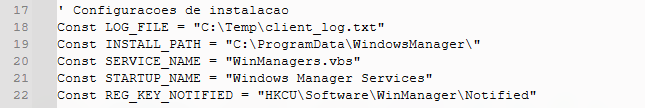
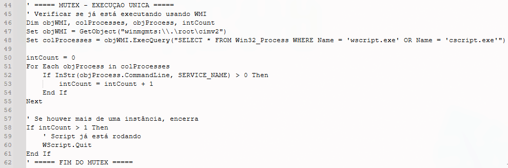
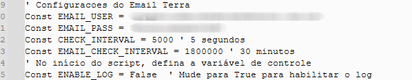

# 🔬 Análise Técnica Detalhada: [RAT/sorvepotel]

* **sha256**: f6e94fa9e9316191168dd36a698a02f4dfd914b5533f4161f5e1377470e034c2

* **File name**: Orcamento.zip

* **First seen**: 2025-10-13 22:21:34 UTC

Este repositório serve como portfólio para apresentar uma análise aprofundada de um malware baseado em VBScript, focado em sua ofuscação de múltiplas camadas, persistência robusta e capacidades de Comando e Controle (C2). O objetivo desta análise é dissecar o *modus operandi* da ameaça, desde a execução inicial até a comunicação com o servidor C2 e o rol completo de comandos suportados.

Este malware vem sendo utilizado em campanhas recentes no Brasil e enviado através do whatsapp com variados nomes (nesta amostra: orcamento.vbs). A campanha parece incluir outros formatos de arquivo como .exe, .msi e tem sido chamada de sorvete no pote, ou sorvepotel.

---

### 1. Desofuscação Inicial (Camada 1)

O malware utiliza uma camada inicial de ofuscação em VBScript para esconder o *payload* principal.

| Ação Original | Método de Desobfuscação | Resultado |
| :--- | :--- | :--- |
| O VBScript executa `ExecuteGlobal varTJtFM` | A instrução `ExecuteGlobal` foi substituída por `WScript.Echo` | O código da segunda camada foi totalmente revelado, permitindo a análise estática do *payload* completo. |

---

### 2. Modo de Operação, Instalação e Persistência

O *malware* possui uma função de auto-instalação que estabelece persistência tripla no sistema operacional da vítima.

#### ⚙️ Detalhes da Instalação no Sistema

* **Local de Instalação do Serviço:** `C:\ProgramData\WindowsManager\`
* **Arquivo do Serviço:** `WinManagers.vbs`
* **Arquivo de Logs:** `C:\Temp\client_log.txt`
* **Arquivo de Registro:** `HKCU\Software\WinManager\Notified`

#### 🔗 Mecanismos de Persistência

O malware emprega múltiplas técnicas para garantir a execução contínua:

1.  **Chave de Registro (Run Key):**
    * **Caminho:** `HKCU\Software\Microsoft\Windows\CurrentVersion\Run\Windows Manager Services`
    * **Valor:** `wscript.exe strInstallFile REG_SZ` (Execução a cada *login* do usuário).
    

2.  **Serviço:**
    * **Nome do Serviço Criado:** `Windows Manager Services`
    * **Ação:** O serviço é iniciado imediatamente após a instalação e utiliza um nome comum para enganar o usuário. *"Windows Manager Services"* é um nome trocado de *"Windows Services Manager"* um serviço legítimo de gerenciamento do Windows, executado através do binário `services.msc`.
    

3.  **Tarefa Agendada (Schtasks):**
    * **Comando:** `schtasks /create /tn "Windows Manager Services" /sc onstart /ru SYSTEM /f`
    * **Detalhe:** Cria uma tarefa agendada que executa o *script* no início do sistema, utilizando privilégios de `SYSTEM` para resiliência máxima. 
    

#### 🔒 Prevenção de Múltiplas Execuções (MUTEX)

O *malware* utiliza WMI para verificar a execução de processos de *scripting* (`'wscript.exe'` ou `'cscript.exe'`), funcionando como um mecanismo de MUTEX rudimentar para evitar redundância.

---

### 3. Comunicação com Comando e Controle (C2)

O C2 é o ponto central para a exfiltração de dados e a emissão de comandos, e neste malware detém um sistema de modificação de endereços do C2 para tentar esconder o ip, ao mesmo tempo que facilita sua persistência no sistema da vítima.

#### 📡 Descoberta e Endereço do C2

* **Mecanismo de Descoberta:** O malware procura a URL do servidor C2 dentro de um **e-mail específico**.

* **Arquivo Temporário:** `C:\Temp\email_out.txt` é criado para armazenar o resultado da requisição que contém o link do C2.

* **URL Reportada em Análise (Anyrun):** `https://shopeeship[.]com/api[.]php` (por conta da rotação de endereços C2, não é possível garantir que esta url será utilizada com regularidade.

* **Detalhe:** O domínio está registrado via **Domains By Proxy**, indicando uma tentativa de ofuscar os operadores da ameaça.

#### 🔄 Ciclo de Operação do C2

Após o registro da vítima, inicia-se um loop de comunicação:

* **Heartbeats:** Envio de sinais de vida a cada 6 iterações do loop principal.
* **Verificação de C2:** O e-mail é verificado periodicamente para garantir a validade ou atualizar o endereço do servidor C2.
* **Conexão Backup:** Verifica a existência de um *failover* (conexão de backup) caso o C2 primário não responda. 

#### 📦 Exfiltração de Dados

* **Frequência e Método:** O envio de dados da vítima ocorre em lotes de **15 KB**, em intervalos de **30 segundos**, via requisições HTTP **POST** para o C2.
* **IP Público:** O endereço IP público da vítima é obtido via `api.ipify.org`.

---

### 4. Informações Coletadas da Vítima

O *malware* coleta um ID único e diversas informações de *fingerprinting* do sistema:

| Categoria | Detalhes Coletados |
| :--- | :--- |
| **Identificação Única** | ID gerado a partir do número serial do HD e do endereço MAC. |
| **Rede** | Endereço IP. |
| **Sistema e Usuário** | Nome do Computador, Nome de Usuário. |
| **Sistema Operacional** | Versão do Windows e Data da Instalação. |

---

### 5. Comandos Suportados pelo C2

A presença destes comandos no código demonstra o alto nível de controle que o operador do C2 pode exercer sobre a máquina infectada:

| Categoria | Comandos Suportados |
| :--- | :--- |
| **Coleta de Dados** | `EnviarInfo`, `CaptureScreen`, `GetTaskList` |
| **Controle de Arquivos** | `UploadFileInChunks`, `ListFiles`, `DownloadFileFromClient`, `UploadFileToClient`, `DeleteFileORFolder`, `RenameFileOrFolder`, `RenameFileOrFolderMoveFileOrFolder`, `GetFileInfo`, `SearchFiles`, `CreatFolder` |
| **Execução Remota** | `ExecutarCMD`, `ExecutarPS` |
| **Controle do Sistema** | `ReiniciarPC`, `DesligarPC`, `KillProcess` |
| **Manutenção do Malware** | Contém uma função para **atualizar** o *malware*, potencializando a ameaça.|

---

## 💡 Conclusão e Implicações de Segurança

Esta análise confirma que o VBScript continua sendo uma linguagem viável para o desenvolvimento de *malware* com alta capacidade de evasão e persistência. A combinação de ofuscação simples, persistência tripla (Run Key, Serviço e Tarefa Agendada) e um conjunto de comandos de controle de arquivos e execução remota demonstra que este *malware* atua como uma ferramenta de Acesso Remoto (**RAT**) completa.

**Implicações de Defesa:** A identificação precoce das chamadas de API ou *strings* relacionadas à manipulação de chaves de registro, criação de serviços e o uso de `schtasks` são pontos críticos para a segurança. O conhecimento detalhado do ciclo de comunicação C2 (heartbeats, verificação de e-mail) é essencial para a criação de regras de detecção de tráfego de rede eficazes. É preciso atentar para a mudança rápida de servidores C2 em caso de infecção de múltiplas máquinas de um mesmo ambiente. Este trabalho visa contribuir para a melhoria da postura de segurança, fornecendo dados concretos sobre a tática, técnica e procedimento (TTPs) desta ameaça.
